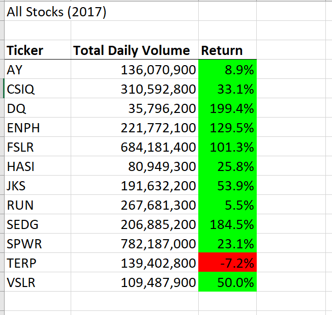
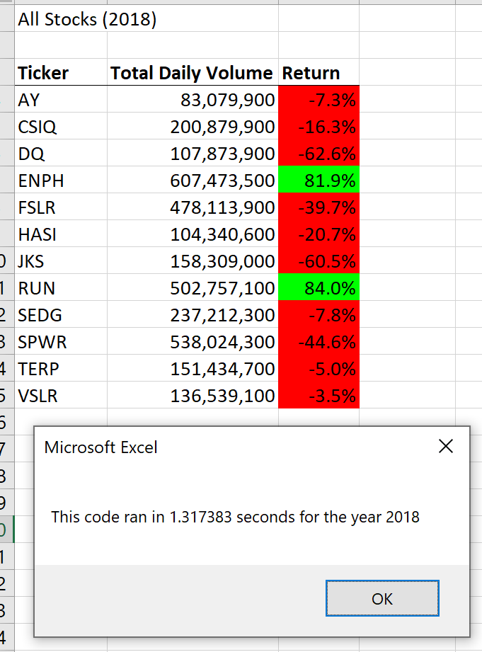
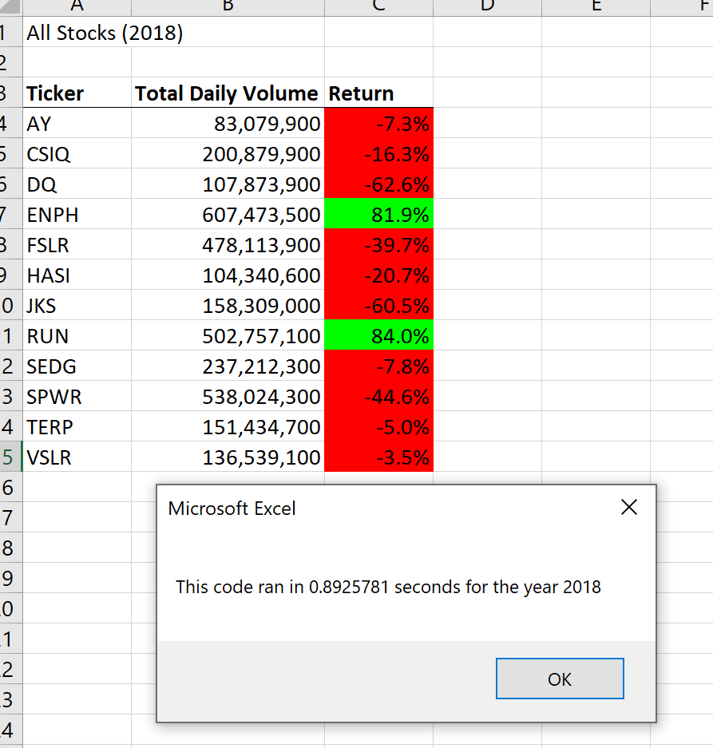

# stock-analysis
## Overview of Project
### Background
We, as data professional, are using VBA in this stock analysis project to help Steve who graduated with a Finance background, to analyze multiple stocks to find some better choices for his parents to invest in. We are given 12 different tickers and two datasets of over 3000 rows for 2018 and 2017 stock activities that associate with the 12 stocks.  
### Purpose
This stock analysis is to analyze a whole list of 12 stocks and to find out how the stocks performed in 2018 and then to measure each ticker's performance by calculating the total daily volume and return in each year. The result of performance is used to offer better stocks to invest in. In addition, we challenged ourselves to make the code more efficient by using a solution of refactoring code to improve the logic of the original script.  

## Results
### Comparing the stock performance between 2017 and 2018
In this project, we ran analysis on all of the stocks by creating a flexible macro yearValueAnalysis(). This code consists of three main steps: 1) formatting the output sheet on the "All Stocks Analysis" worksheet; 2) initializing an array of all tickers and looping through the tickers and rows in the data to find the total volume, starting price and ending price for the tickers; 3) output the analysis data for tickers. To make it easier for Steve to run the analysis, we further added a macro button on the worksheet so he can run the results for year of 2017 or 2018 to compare the stock performance. 

```
    Sub yearValueAnalysis()

    yearValue = InputBox("What year would you like to run the analysis on?")
    startTime = Timer

    '3b) Activate the data worksheet.
    Sheets(yearValue).Activate
```

The results show that most of the tickers had a positive return in 2017, especially the DQ ticker that Steve's parents were highly interested in investing in had the highest return percentage of all.

 

However, in 2018, most of the tickers had a negative return, but the returns on both tickers ENPH and RUN are almost the same high. Based on the results, ENPH and RUN are better options for Steve's parents to invest in and ENPH is a safer investment choice with a relatively more stable return. 



### Comparing the execution times of the original script and the refactored script
To achieve a faster running time, we refactored the code by creating a tickerIndex variable and then use this to access the correct index across four different arrays: the tickers array and three output arrays. 


In the end, we ran the refactoring code and the original code and find out that the outputs are the same but the elapsed run time for the refactored code is faster.
 

## Summary

1. What are the advantages or disadvantages of refactoring code?

To summarize, we can tell from the results of the execution times that refactoring code obviously improved the efficiency of the code and had a faster run time due to the changes. This change leads to better quality of code. However, refactoring could be difficult for a new or beginner-level programmer to write and there is a risk of new errors or bugs in the code when the original script does not have proper test cases. Refactoring errors could impact the analysis results. 

2. How do these pros and cons apply to refactoring the original VBA script? 

It appears that refactored code reduced the processing time for analyzing the data because it improves the logic of the code and could simplify cumbersome expression and provide more clarity and concise syntax. However, when considering refactoring original VBA script, we should evaluate whether refactoring code is hard to understand or too complex to even remember how you designed it when you need to review the code after a long time. Additionally, original code will switch to output work sheet to output the results in each loop. Refactored code will hold the results in the array which reduces the cost of switching work sheet. 
